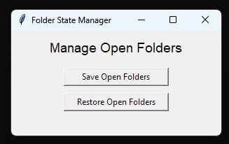

# WinSaveOpenFolders

Small Windows utility to **save** and **restore** currently open File Explorer folders.


It provides three ways to run:
- **EXE (recommended):** no install, just run it
- **PowerShell GUI:** no Python needed (Windows + PowerShell)
- **Python script:** for source users / devs

## Download (Recommended)
Go to the **Releases** section on GitHub and download the latest `WinSaveOpenFolders_Windows.zip`.

## How it works
- **Save Open Folders**: collects currently opened File Explorer windows and stores their paths.
- **Restore Open Folders**: reopens those folders in File Explorer.

## Run options

### 1) EXE (No install)
1. Download the latest release ZIP
2. Unzip
3. Run `WinSaveOpenFolders.exe`

### 2) PowerShell version (No Python)
Run:
- `WinSaveOpenFolders.cmd` (double-click)
or
- `WinSaveOpenFolders.ps1`

> If Windows blocks scripts, right-click the `.ps1` → Properties → “Unblock” (if present).

### 3) Python version
Requires Python 3 on Windows.
Run:
```bash

### Notes

This tool is Windows-only.

Your saved folder list is stored locally.
python WinSaveOpenFolders.py

### License
MIT
